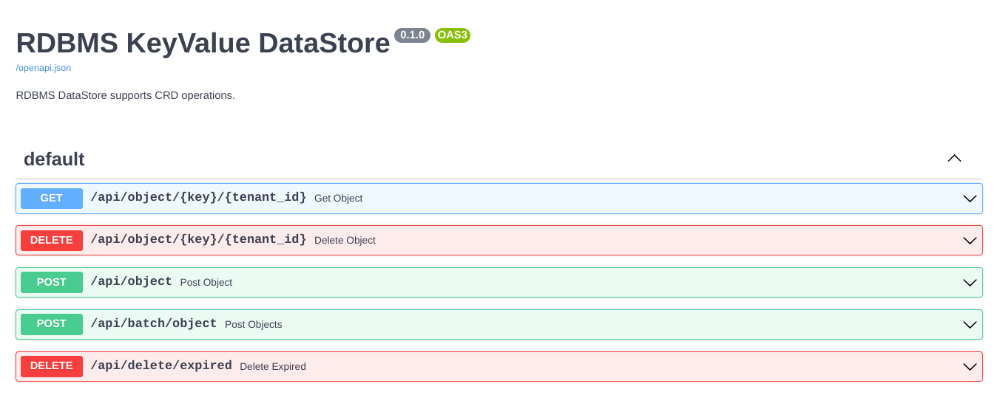
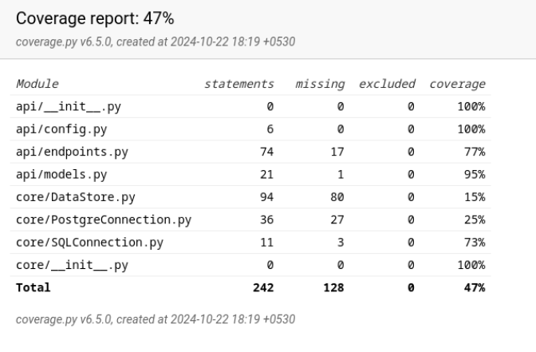

# RDBMSDataStore


<br>
Advanced Key-value DataStore supports CRUD operations and provides different storage levels for users of various tiers.


### Installing PostgreSQL on Ubuntu/Debian

1. **Update Package Index**:
   ```bash
   sudo apt update
   ```

2. **Install PostgreSQL**:
   ```bash
   sudo apt install postgresql postgresql-contrib
   ```

3. **Start and Enable PostgreSQL Service**:
   ```bash
   sudo systemctl start postgresql
   sudo systemctl enable postgresql
   ```

4. **Check PostgreSQL Status**:
   ```bash
   sudo systemctl status postgresql
   ```

5. **Switch to the PostgreSQL User**:
   By default, PostgreSQL creates a user named `postgres`. Switch to this user to manage the database:
   ```bash
   sudo -i -u postgres
   ```

6. **Access PostgreSQL Prompt**:
   ```bash
   psql
   ```

7. **Exit PostgreSQL Prompt**:
   To exit the prompt, type:
   ```SQL
   \q
   ```

### Post-Installation Steps

1. **Create a New Role**: After accessing the PostgreSQL prompt, you may want to create a new user role:
   ```SQL
   CREATE ROLE radeep WITH LOGIN PASSWORD 'ViratKohli#18';
   ```

2. **Create a Database**: You can also create a new database:
   ```SQL
   CREATE DATABASE DataStore WITH OWNER radeep;
   ```

# Data Migration Guide.

PostgreSQL provides native migration tools(`pg_dump` and `pg_restore`)

1. **Exporting the database using `pg_dump`**:

   The below command asks for the password, it creates the .sql file in the current working directory or path mentioned in the command
      ```
      pg_dump -U user_name -d database_name -h localhost > {path}/file_name.sql
      ```

3. **Importing the database using `psql` or   `pg_restore`**:

   The below command asks for the password, download the filename.sql from the remote host and it will replicate the same SQL relation setup in your remote_database_name

   ```
   psql -U remote_user_name -d remote_database_name -h remote_host -f file_name.sql
   ```


### KeyValue Table Schema


| Column Name  | Data Type    | Constraints                                          | Description                                                    |
|--------------|--------------|------------------------------------------------------|----------------------------------------------------------------|
| `id`         | `INT`        | `AUTO_INCREMENT PRIMARY KEY`                         | Unique identifier for each record                              |
| `tenant_id`  | `VARCHAR(32)`| `NOT NULL`                                           | Identifier for the tenant                                      |
| `key`        | `VARCHAR(32)`| `NOT NULL UNIQUE`                                    | Unique key for the data                                        |
| `data`       | `TEXT`       | `NOT NULL`                                           | Value associated with the key                                  |
| `size`       | `INT`        | `NOT NULL`                                           | size of the data stored                                        |
| `ttl`        | `INT`        | `DEFAULT NULL`                                       | Time-to-live for the key-value pair (in seconds)               |
| `created_at` | `TIMESTAMP`  | `DEFAULT CURRENT_TIMESTAMP`                          | Timestamp of when the record was created                       |
| `expiry_time`| `TIMESTAMP`  | `DEFAULT ADDTIME(CURRENT_TIMESTAMP, INTERVAL 7 DAY)` | Expiry time for the entry, defaults to 7 days after creation   |


### SQL Query for Roles Table
```SQL
CREATE TABLE roles (
    role_id SERIAL PRIMARY KEY, 
    role_name VARCHAR(100) NOT NULL UNIQUE
);
```

### SQL Query for Tiers Table
```
CREATE TABLE tiers (
    tier_level INTEGER PRIMARY KEY,
    storage_limit INTEGER
);
```

### SQL Query for KeyValue Table

```SQL
CREATE TABLE keyvalue (
    id SERIAL PRIMARY KEY,
    tenant_id VARCHAR(32) NOT NULL,
    key VARCHAR(32) NOT NULL,
    data TEXT NOT NULL,
    size INT NOT NULL,
    ttl INT DEFAULT 7,
    created_at TIMESTAMP DEFAULT CURRENT_TIMESTAMP,
    expiry_time TIMESTAMP DEFAULT CURRENT_TIMESTAMP + INTERVAL '7 days',
   UNIQUE (tenant_id, key)
);
```

# API Endpoints

The API provides endpoints for managing data objects in the key-value store:

### Retrieve Object
- **GET /object/{key}/{tenant_id}**
  - Retrieves an object identified by `key` for a specific `tenant_id`.
  - **Request Parameters:**
    - `key` (string): The key of the object to retrieve.
    - `tenant_id` (string): The tenant ID associated with the object.
  - **Response Codes:**
    - 200 (OK): Successful retrieval with object data or appropriate message.
    - 404 (Not Found): Tenant not found or key does not exist.
    - 502 (Bad Gateway): Internal server error during operation.

### Delete Object
- **DELETE /object/{key}/{tenant_id}**
  - Deletes an object identified by `key` for a specific `tenant_id`.
  - **Request Parameters:**
    - `key` (string): The key of the object to delete.
    - `tenant_id` (string): The tenant ID associated with the object.
  - **Response Codes:**
    - 200 (OK): Successful deletion with confirmation message.
    - 404 (Not Found): Tenant not found or key does not exist.
    - 502 (Bad Gateway): Internal server error during operation.

### Create Object
- **POST /object**
  - Creates a new object in the data store.
  - **Request Body:**
    - JSON data representing the object (refer to `api.models.PostData`).
  - **Response Codes:**
    - 201 (Created): Successful creation with confirmation message.
    - 409 (Conflict): Record already exists for the provided `tenant_id` and `key`.
    - 502 (Bad Gateway): Internal server error during operation.

### Batch Create Objects
- **POST /batch/object**
  - Creates multiple objects in the data store in a batch.
  - **Request Body:**
    - JSON array of objects (refer to `api.models.PostData`).
  - **Response Codes:**
    - 200 (OK): Successful creation with details on success, failures, and duplicates.
    - 502 (Bad Gateway): Internal server error during operation.

# Data Models

The `api.models` module defines data models used in API requests and responses:

### PostData
- `key` (string): Unique identifier for the object.
- `tenant_id` (string): Tenant ID associated with the object.
- `value` (any): The actual data stored for the object.
- `ttl` (int, optional): Time-to-live (in seconds) for the object.

### GetData (internal)
- `key` (string): Unique identifier for the object.
- `tenant_id` (string): Tenant ID associated with the object.

### DeleteData (internal)
- `key` (string): Unique identifier for the object.
- `tenant_id` (string): Tenant ID associated with the object.


### Running the FastAPI

Running the below command from directory: RDBMSDataStore/src

```
 python3 main.py
```

### FastAPI Endpoints Visualizer



### Unit test cases coverage



